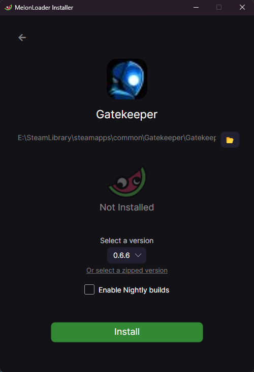

# Gatemeter

Damage meter mod for the game Gatekeeper by Gravity Lagoon

## ✨ Features

-   Live charts for damage dealt and enemies killed (current level and total)
-   List of items acquired by everyone in your lobby
-   Keep track of your triad progress
-   Opens in a web browser

## 🛠️ Installation

-   Install the .NET 6.0 runtime:
    -   Go to the [downloads page](https://dotnet.microsoft.com/en-us/download/dotnet/6.0)
    -   Scroll down and find the table that says ".NET Runtime 6.x.xx":
        
    -   Download and run the installer for your architecture (usually `x64`)
-   Install MelonLoader in your Gatekeeper directory:
    -   Go to [MelonLoader's releases page on GitHub](https://github.com/LavaGang/MelonLoader/releases/latest)
    -   Download `MelonLoader.Installer.exe` in the list of assets
    -   Start the installer
    -   Click on Gatekeeper in the list of games, then click "Install"  
        
        -   If the game is not in the list, click "Add Game Manually", browse to the game's directory and select `Gatekeeper.exe`
-   Install the mod:
    -   Go to the [mod's releases page](https://github.com/r-o-b-o-t-o/gatemeter/releases/latest)
    -   Download `Gatemeter.zip` in the list of assets
    -   Unzip the archive into the game directory (⚠️ use "Extract Here", don't extract to a subfolder!)
-   Start the game
-   The damage meter will open in your default web browser

## ⚙️ Developer Setup

### Requirements

-   MelonLoader
-   .NET 6 SDK, Visual Studio is recommended
-   Node.JS

### Project Setup

-   Install [MelonLoader](https://melonloader.org/) in your Gatekeeper directory, see [🛠️ Installation](#%EF%B8%8F-installation)
-   Start the game once, MelonLoader will extract all the DLLs required by the project
-   Duplicate `Gatemeter.csproj.user.dist`, rename the copy as `Gatemeter.csproj.user`
-   Edit `Gatemeter.csproj.user` and set the `<GamePath>` tag to the full path of your Gatekeeper game directory
-   Open `Gatemeter.sln` in Visual Studio:
    -   Click Build > Build Solution (<kbd>F6</kbd>) to build the mod
    -   Building the solution will also copy the resulting DLL into the game directory with a post-build event
-   Open a command prompt in the `ui` directory:
    -   Run `npm i` to install the dependencies
    -   Run `npm run dev` to serve the frontend

## 🤝 Contributing

Contributions are **greatly appreciated**.

If you have a suggestion that would make this project better, feel free to fork the repository and create a Pull Request. You can also open a [Feature Request](https://github.com/r-o-b-o-t-o/gatemeter/issues/new?assignees=&labels=enhancement&template=feature_request.yml).

## ⭐️ Show your support

⭐️ Give the project a star if you like it!

<a href="https://ko-fi.com/roboto" target="_blank">
